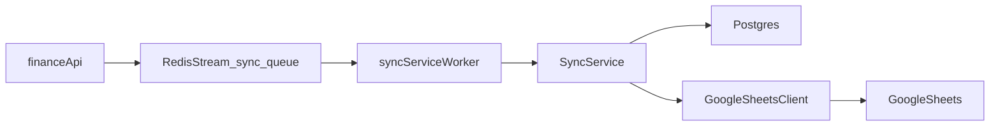

backend
=======

Sync service and Redis Streams
------------------------------

### sync\_queue contract

The sync service and finance-api communicate via a Redis Stream named `sync_queue`. Entries on this stream use the following field schema:

- **entity**: logical entity type, e.g. `transaction` or `account`.
- **operation**: operation name, e.g. `create`, `update`, `delete`, or `full_sync`.
- **payload**: JSON-encoded job payload.
- **retry_count**: integer count of processing attempts (optional, defaults to 0).

The job payload for transaction syncs follows this shape:

```json
{
  "userId": "uuid-of-user",
  "connectionId": "uuid-of-sheets-connection",
  "mode": "two-way",
  "sinceVersion": 42
}
```

This structure is consumed by `SyncService` via the `SyncJobPayload` type and produced by services such as `TransactionService` through their `SyncQueue` abstraction.

The sync worker uses a Redis consumer group named `sync_workers` attached to the `sync_queue` stream. Each sync-service instance uses a distinct consumer name (e.g. `sync-service`) to allow horizontal scaling.

### Sync service behavior

The sync service is implemented in `cmd/api/sync-service/main.go` and uses:

- `pkg/shared/config` to load environment-specific configuration (DB URL, Redis URL, server address).
- `pkg/shared/db` to create a `pgxpool.Pool` for Postgres.
- `pkg/shared/redisx` to create and verify a Redis client.
- `internal/queue.RedisStreamQueue` to connect to the `sync_queue` stream with the `sync_workers` group.
- `internal/worker.Runner` to consume jobs and invoke the sync domain service.

The domain layer for sync lives under `internal/sync`:

- `SheetsClient` abstraction with a `NoopSheetsClient` implementation for local/dev use.
- `SyncService` orchestrating:
  - Loading `sheets_connections` and `sheet_mappings` via repositories in `internal/db/sync_repositories.go`.
  - Reading relevant `change_events` via `PGChangeEventReader`.
  - Converting local transaction events into `SheetRowChange` instances.
  - Fetching remote changes from `SheetsClient` (currently a stub).
  - Applying local changes to Google Sheets using `SheetsClient.ApplyChanges`.

Worker behavior is implemented via:

- `internal/queue.RedisStreamQueue.Consume` which:
  - Ensures the `sync_workers` consumer group exists.
  - Uses `XREADGROUP` in a loop with a configurable block timeout.
  - Acknowledges messages (`XACK`) only after the handler succeeds.
  - Leaves failed messages pending in Redis for later retries.
- `internal/worker.Runner.Start` which:
  - Wraps the queue consumption with logging.
  - Measures per-job duration.
  - Applies a simple exponential backoff (`1 + retry_count` seconds) before returning an error, allowing Redis pending-entry semantics to drive retries.

### Local development

The `docker-compose.yml` file runs Postgres, Redis, and the various backend services, including `sync-service`. To start a local stack:

```bash
docker-compose up --build
```

Key configuration values for the sync service:

- **Database URL**: `SYNC-SERVICE_DATABASE_URL` (overrides `database.url` from `configs/{env}.yaml`).
- **Redis URL**: `SYNC-SERVICE_REDIS_URL` (overrides `redis.url` from `configs/{env}.yaml`).
- **Server address**: `SYNC-SERVICE_SERVER_ADDR` (overrides `server.addr` from `configs/{env}.yaml`).

The sync service exposes:

- `GET /health` – checks Postgres and Redis connectivity.
- (Future) `/api/v1/sheets` and `/api/v1/sync` endpoints for managing connections and triggering manual syncs.

### Dataflow

The high-level Google Sheets sync flow is:



In words:

- `finance-api` (and other writers) enqueue sync jobs to the Redis Stream `sync_queue`.
- The sync service's worker consumes jobs from `sync_queue` via a consumer group.
- `SyncService` orchestrates reads from Postgres and Google Sheets.
- Changes are written back to Postgres (via existing repositories/services) and to Google Sheets via the pluggable `SheetsClient` implementation.

