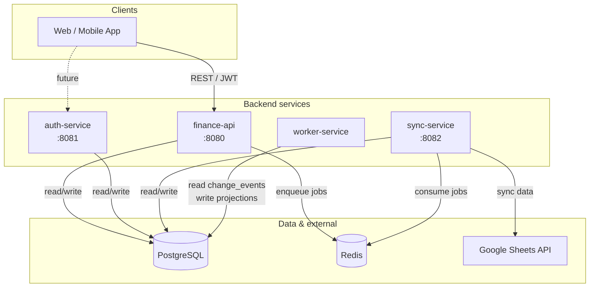
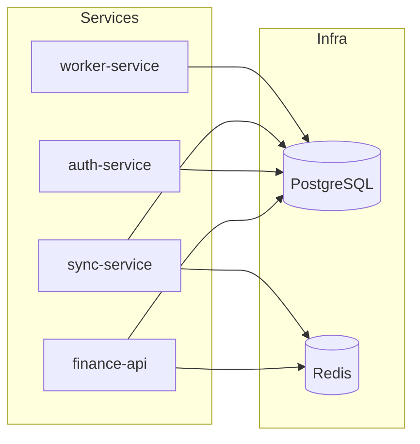
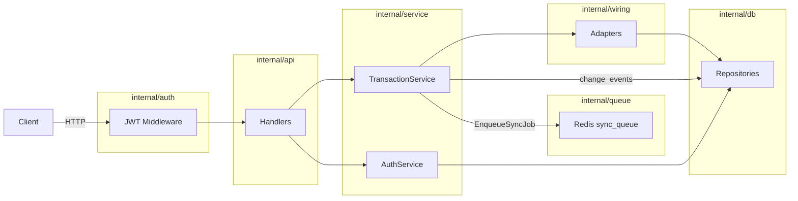
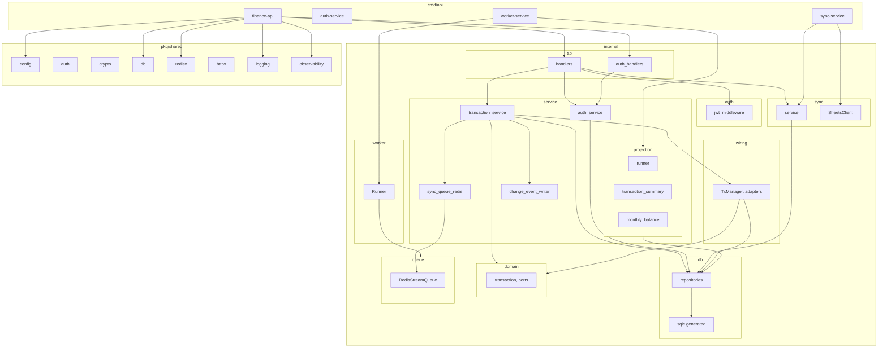

# Moon Eye Backend — Architecture

This document describes the backend architecture: services, modules, data flow, and dependencies. Diagrams are in [Mermaid](https://mermaid.js.org/) and render on GitHub and in most Markdown viewers.

---

## 1. System context (high level)

Clients talk to the main API; services share PostgreSQL and communicate async via Redis. Optional: Google Sheets for sync.



**Summary**

| Component        | Role |
|-----------------|------|
| **finance-api** | Primary REST API: transactions, auth (register/login/refresh), sheets connections, sync trigger. Writes to DB and enqueues sync jobs to Redis. |
| **auth-service** | Dedicated auth (stub). Auth currently lives in finance-api. |
| **sync-service** | Consumes `sync_queue` from Redis; runs SyncService (Postgres + Google Sheets). |
| **worker-service** | Reads `change_events` from Postgres; writes to `transaction_summary` and `monthly_balance`. |
| **PostgreSQL**   | Single database: users, accounts, categories, transactions, change_events, sheets_connections, sheet_mappings, projection tables. |
| **Redis**        | Stream `sync_queue` + consumer group `sync_workers` for async sync jobs. |

---

## 2. Service dependencies

What each service depends on (infrastructure and direction).



- **finance-api**: PostgreSQL (repos, tx, migrations), Redis (sync queue producer).
- **auth-service**: PostgreSQL only (stub).
- **sync-service**: PostgreSQL (connections, mappings, change_events), Redis (sync queue consumer).
- **worker-service**: PostgreSQL only (change_events + projection tables).

---

## 3. Data flow

### 3.1 Request flow (finance-api)

HTTP → handler → service → repository / queue. Business logic stays in the service layer.



### 3.2 Sync flow (transaction change → sheets)

TransactionService writes change_events and enqueues a sync job; sync-service consumes and runs SyncService.

```mermaid
flowchart TB
    subgraph FinanceAPI["finance-api"]
        TxSvc[TransactionService]
        EvtWriter[ChangeEventWriter]
        SyncQueueProd[SyncQueue Producer]
    end
    subgraph DB1[(PostgreSQL)]
        CE[change_events]
        TC[transactions]
    end
    subgraph Redis1[(Redis)]
        SQ[sync_queue stream]
    end
    subgraph SyncSvc["sync-service"]
        Worker[worker.Runner]
        SyncSvcDomain[SyncService]
        SheetsCli[SheetsClient]
    end
    subgraph DB2[(PostgreSQL)]
        Conn[sheets_connections]
        Map[sheet_mappings]
        CE2[change_events]
    end
    Ext[Google Sheets API]

    TxSvc --> EvtWriter
    EvtWriter --> CE
    TxSvc --> SyncQueueProd
    SyncQueueProd --> SQ
    SQ --> Worker
    Worker --> SyncSvcDomain
    SyncSvcDomain --> Conn
    SyncSvcDomain --> Map
    SyncSvcDomain --> CE2
    SyncSvcDomain --> SheetsCli
    SheetsCli --> Ext
```

### 3.3 Projection flow (worker-service)

worker-service tails change_events and updates read-model tables.

```mermaid
flowchart LR
    subgraph PG[(PostgreSQL)]
        CE[change_events]
        Cursor[projection_cursor]
        TS[transaction_summary]
        MB[monthly_balance]
    end
    subgraph Worker["worker-service"]
        Source[DBChangeEventSource]
        Runner[projection.Runner]
        Summary[TransactionSummaryProjector]
        Balance[MonthlyBalanceProjector]
    end

    CE --> Source
    Source --> Runner
    Cursor --> Runner
    Runner --> Summary
    Runner --> Balance
    Summary --> TS
    Balance --> MB
```

---

## 4. Module structure (codebase)

Layers and packages inside the backend monorepo. Arrows mean “depends on” or “uses”.



**Layer rules**

- **cmd/** — Entrypoints only; wire config, infra, and handlers.
- **internal/api** — HTTP: parse, validate, call service, return response.
- **internal/service** — Business logic; uses domain, repositories, queue, and wiring adapters.
- **internal/db** — Persistence: repositories, sqlc, models.
- **internal/queue** — Redis Streams producer/consumer abstraction.
- **internal/sync** — Sync domain: SyncService, SheetsClient.
- **internal/worker** — Generic queue consumer runner.
- **pkg/shared** — Reusable libs: config, auth, crypto, db pool, redis client, httpx, logging, observability.

---

## 5. Database schema (logical)

Core tables and how they relate. All services use the same PostgreSQL instance.

```mermaid
erDiagram
    users ||--o{ refresh_tokens : has
    users ||--o{ transactions : has
    users ||--o{ accounts : has
    users ||--o{ categories : has
    users ||--o{ sheets_connections : has
    accounts ||--o{ transactions : has
    categories ||--o{ transactions : has
    sheets_connections ||--o{ sheet_mappings : has
    change_events }o--|| users : "user_id"
    transaction_summary }o--|| users : "user_id"
    monthly_balance }o--|| users : "user_id"
    monthly_balance }o--|| accounts : "account_id"

    users { uuid id string email hashed_password timestamptz created_at timestamptz updated_at bool deleted }
    refresh_tokens { uuid id uuid user_id text encrypted_token timestamptz expires_at bool revoked }
    accounts { uuid id uuid user_id string name string currency timestamptz created_at timestamptz updated_at bool deleted }
    categories { uuid id uuid user_id string name bool is_income uuid parent_id bool deleted }
    transactions { uuid id uuid user_id uuid account_id numeric amount string currency string type uuid category_id text description timestamptz occurred_at jsonb metadata int version bool deleted }
    change_events { bigint id string entity_type uuid entity_id uuid user_id string op_type int version jsonb payload timestamptz created_at }
    sheets_connections { uuid id uuid user_id text sheet_id text sheet_range text sync_mode timestamptz last_synced_at }
    sheet_mappings { uuid id uuid connection_id string sheet_column string db_field jsonb transform }
    transaction_summary { uuid user_id string period_key string currency string type numeric total_amount bigint count }
    monthly_balance { uuid user_id uuid account_id string month_key numeric balance }
```

---

## 6. Scaling and deployment notes

- **finance-api** — Stateless; scale horizontally. One instance can run migrations (or a dedicated job).
- **auth-service** — Stateless; scale horizontally when implemented.
- **sync-service** — Scale by running multiple instances; Redis consumer group `sync_workers` shares the stream. Each instance uses a unique consumer name.
- **worker-service** — Scale by running multiple projection runners with different names; use a single cursor store (e.g. by projector name) or partition by tenant/user if needed.
- **PostgreSQL** — Single primary; add read replicas for read-heavy workloads.
- **Redis** — Single instance or cluster for `sync_queue`; no app-level state.

For a single diagram that fits on one page, use **Section 1 (System context)**. For onboarding and code navigation, use **Sections 3 and 4** (data flow and module structure).
